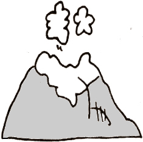

A word from the webmaster: Mixie Lidyan currently lives quite near Mount St. Helens. "The vapors emanating from the crater have been nothing but healthful," she asserts, "and conducive to much creative musing." Her first essay on a Sacred Harp topic was composed shortly after she established residence there, which was after the volcano blew its top in 1980. These essays reflect Academician Lidyan's nit-picking focus on small details in the Denson Sacred Harp and singings that use this book. For those among us who share this personality trait, we are very happy to be able to include them on our website.

The author's name was bestowed by loving parents deeply steeped in early music's church modes as a play on their surname. Her title is unknown, all attempts to locate where she might have received it ended in failure. The Academician's present whereabouts are unknown and no essays from her pen have been received in several years.

